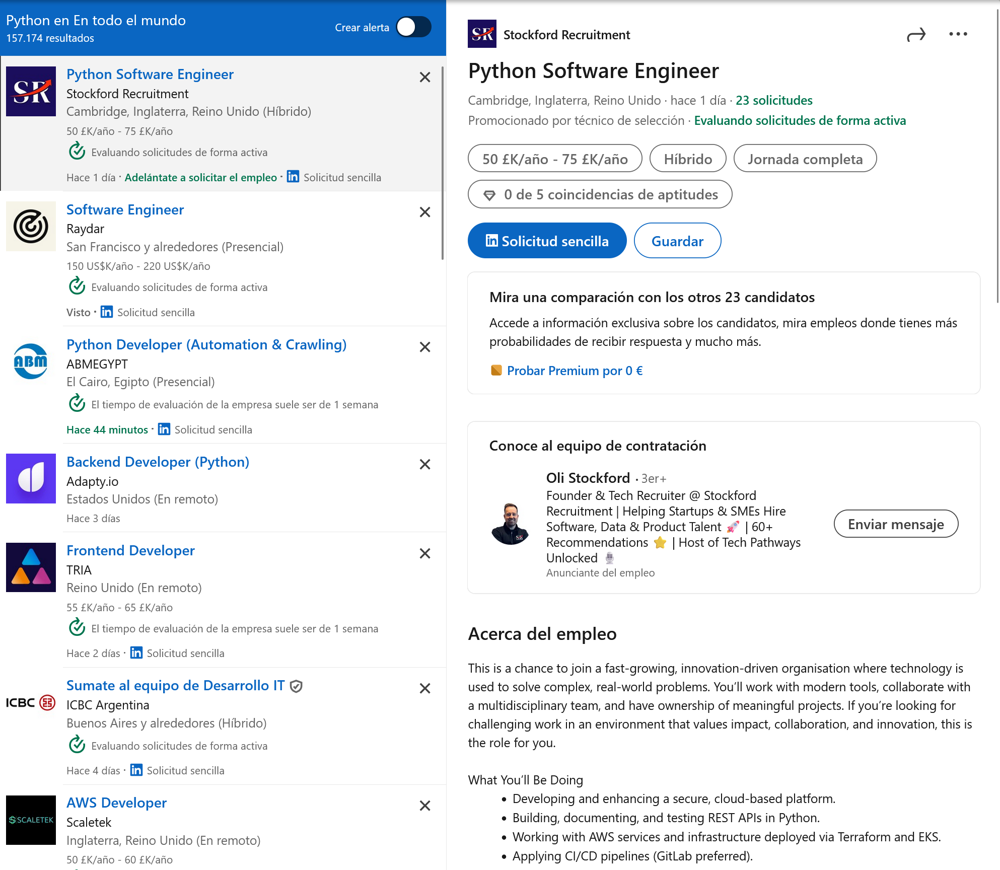
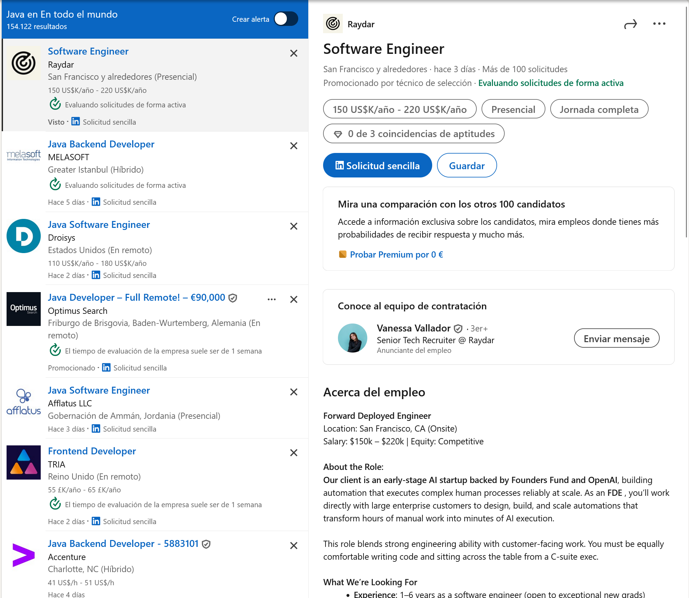
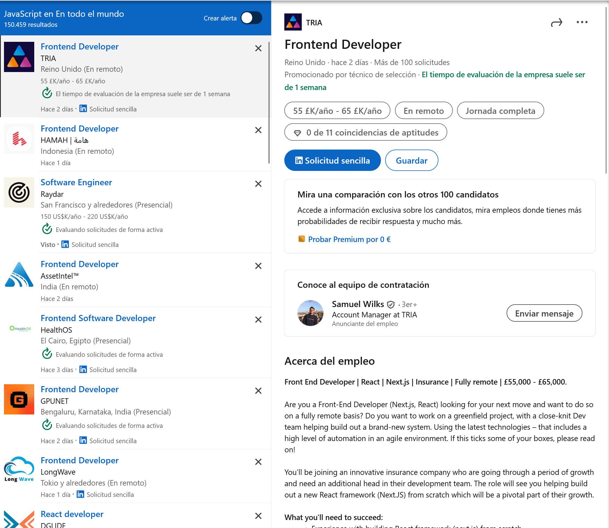
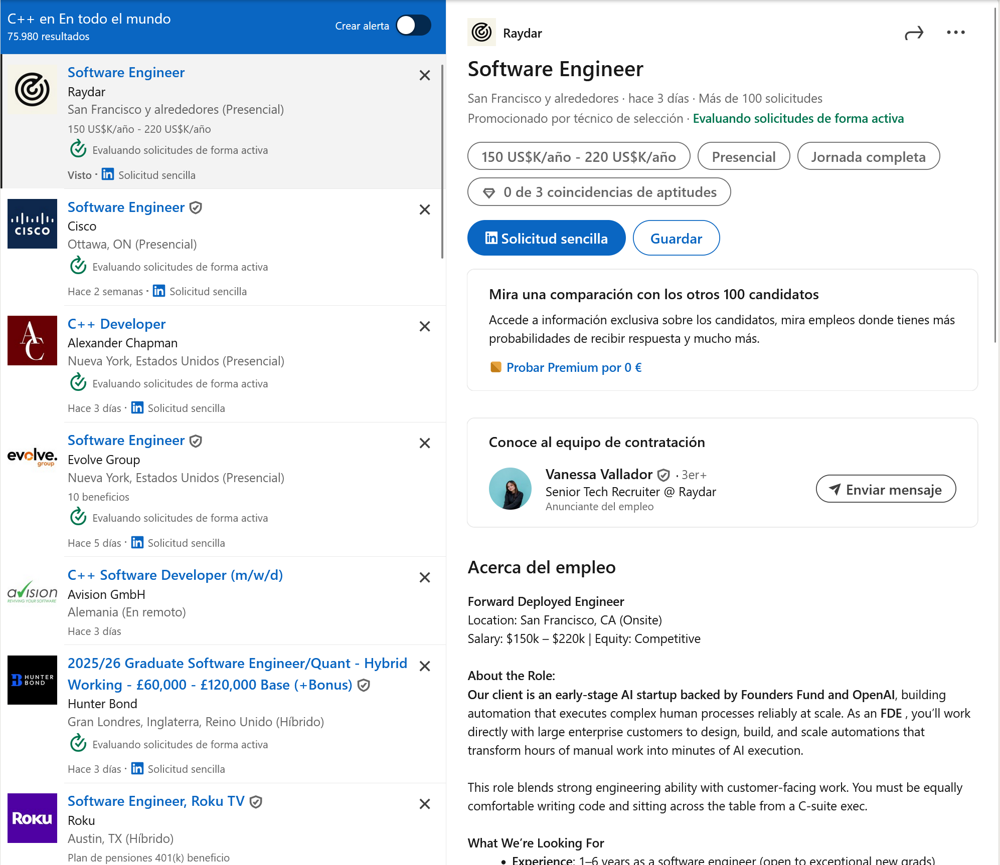
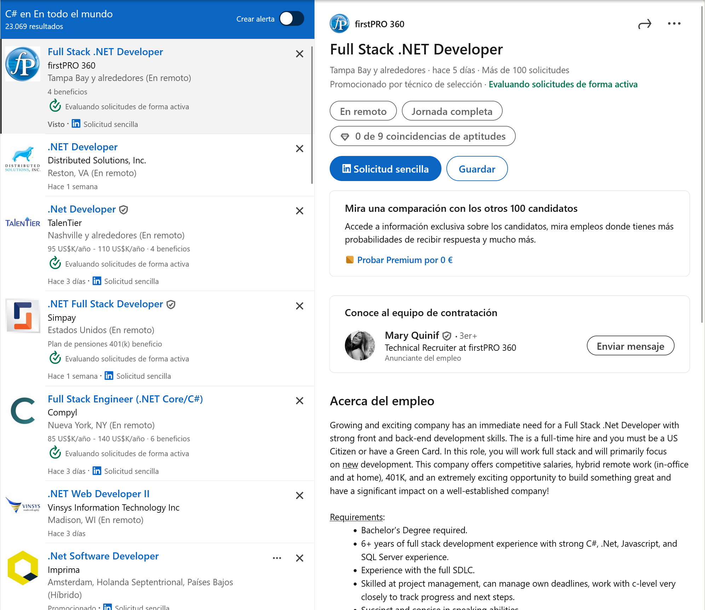
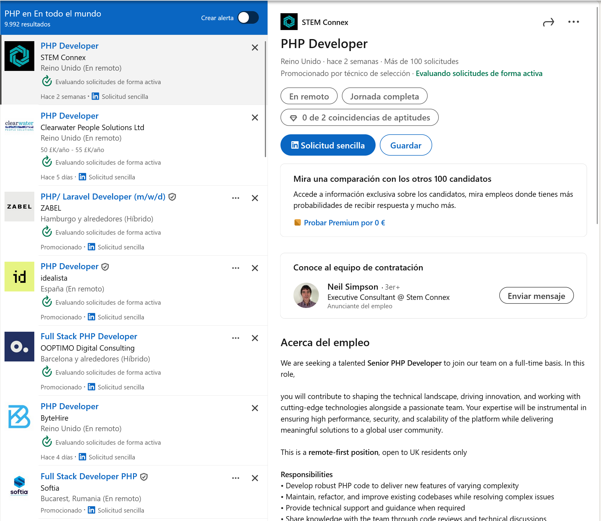
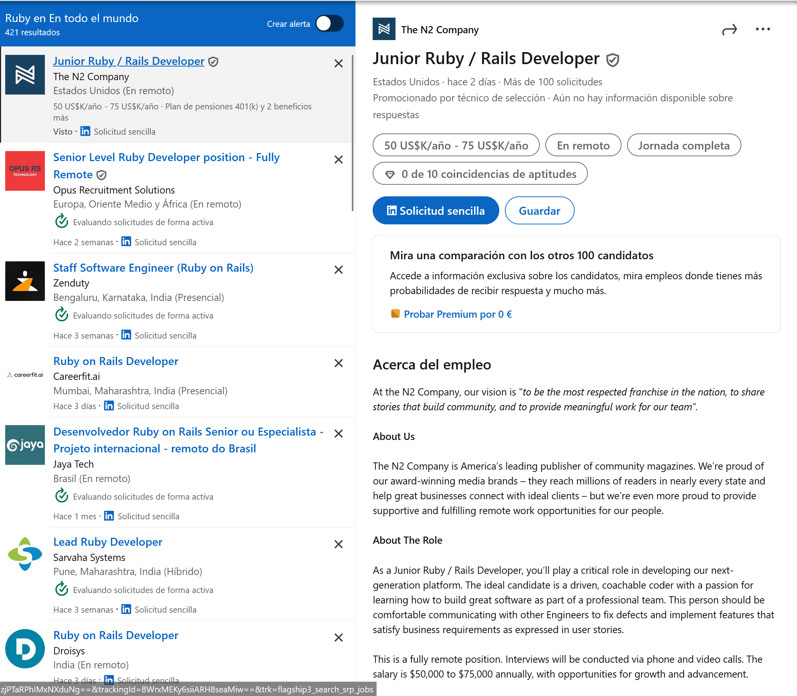
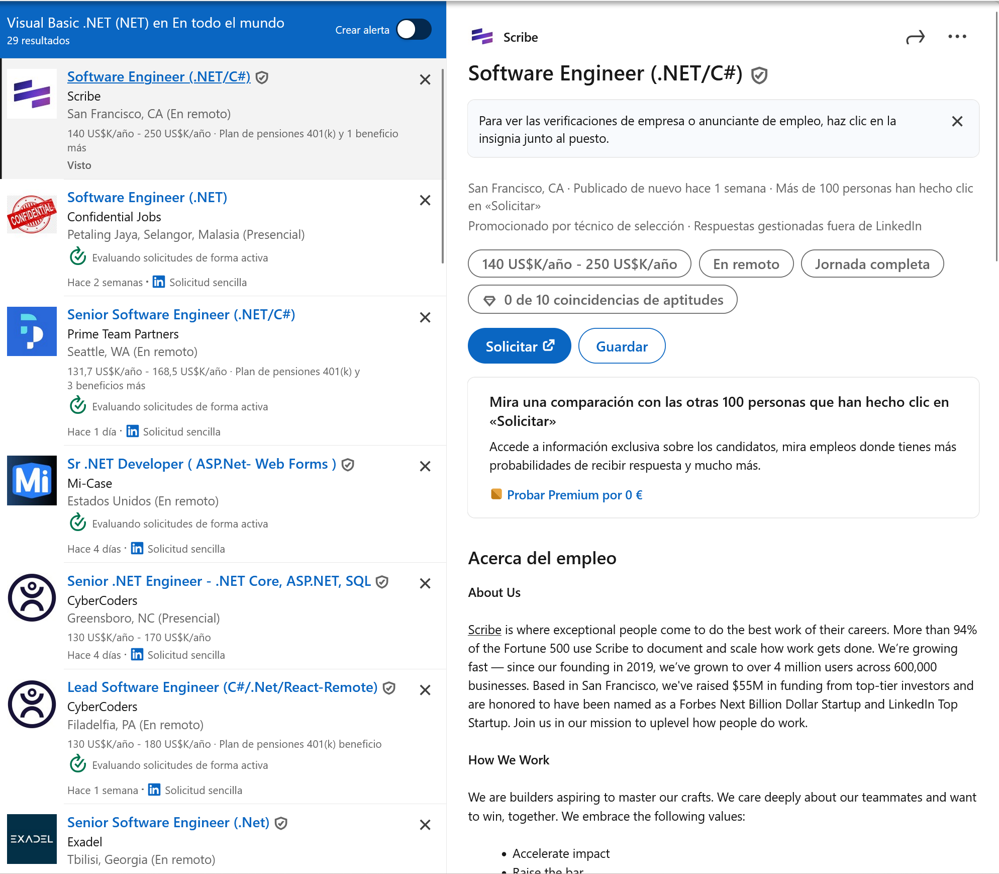

# CFGS_25-26_entornosDeDesarrollo_u1_p3
Veremos una lista ordenada de más a menos de las ofertas de trabajo como desarrollador de software a jorada completa con los distintos lenguajes.
Lo separaremos entre mundo y España.
# Mundo
1. **Python**
157.000 resultados

2. **Java**
   154.000 resultados

3. **JavaScript**
   150.000 resultados

4. **C++**
    75.000 resultados

5. **C#**
    23.000 resultados

6. **PHP**
10.000 resultados

7. **Ruby**
400 resultados

8. **VBNet**
30 resultados

---

